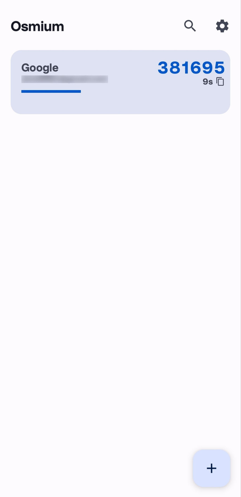
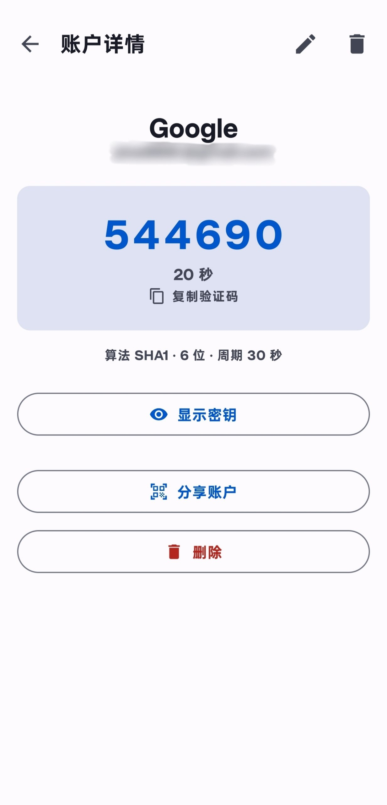
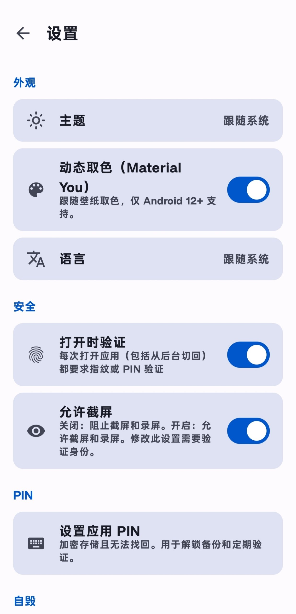
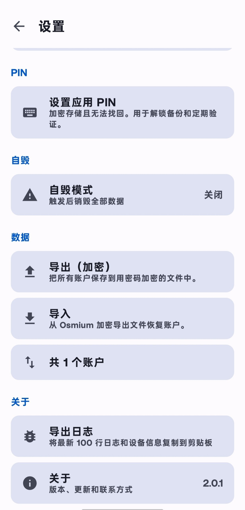
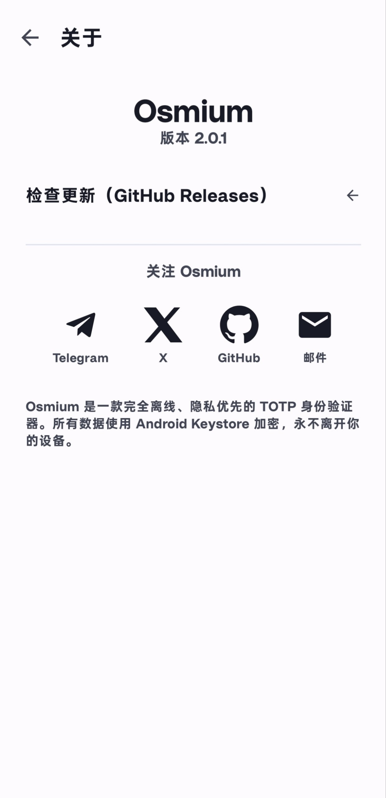

# Osmium 🛡️

Fully offline, privacy-first TOTP authenticator for Android — Material 3 + Jetpack Compose.

离线优先、隐私优先的 Android TOTP 身份验证器。

<p align="center">
  
  
  
  
  
</p>

## 特性 Features

- **完全离线**：无 INTERNET 权限，密钥物理上无法离开设备
- **硬件级加密**：账户数据 AES-256-GCM 字段级加密，密钥存 Android Keystore（TEE/StrongBox）；应用 PIN 为 PBKDF2 加盐哈希 + 二次加密落盘
- **三重门禁**：打开应用（可选）/ 切换敏感设置需 指纹 · 系统密码 · Osmium PIN 任一验证；查看/编辑/删除密钥同样需验证
- **自毁机制**：自毁 PIN 在所有 PIN 输入处生效；连续验证失败 N 次（3/5/10 可设）同样销毁主密钥与全部数据，不可恢复
- **反篡改**：启动时校验 APK 签名，被重打包立即拒绝运行
- **截屏开关**：默认 FLAG_SECURE 禁止截屏录屏，验证身份后可开启
- **TOTP 完整支持**：SHA1/SHA256/SHA512，6/8 位，自定义 period，RFC 6238 官方向量单元测试
- **扫码添加**：CameraX + ML Kit 离线识别 otpauth:// 二维码
- **加密导入/导出**：PBKDF2-HMAC-SHA256 + AES-256-GCM，密码 + PIN 双重保护
- **单账户分享**：验证身份后生成 otpauth:// 二维码供其他设备扫码
- **Material 3**：动态取色、深色模式、中英双语

## 技术栈 Stack

Kotlin · Jetpack Compose · Material 3 · MVVM + Repository · Room · DataStore ·
Android Keystore · CameraX · ML Kit Barcode Scanning · zxing · kotlinx-serialization

minSdk 26 (Android 8.0) / targetSdk 34

## 下载 Download

[GitHub Releases](https://github.com/lihongxi-g/osmium-authenticator/releases) — R8 混淆 + 资源收缩 + 固定签名（侧载安装）

## 构建 Build

GitHub Actions（push 到 main 自动构建 release 包），或本地：

```bash
./gradlew assembleDebug
```

## 测试 Tests

RFC 6238 官方向量、Base32、URI 解析、导入导出加密、PIN 哈希等纯 JVM 单元测试随 CI 运行：

```bash
./gradlew testDebugUnitTest
```

## 反馈 Feedback

Telegram [@osmium2fa](https://t.me/osmium2fa) · X [@lihongxi_l](https://x.com/lihongxi_l) · zhif0776@hotmail.com
